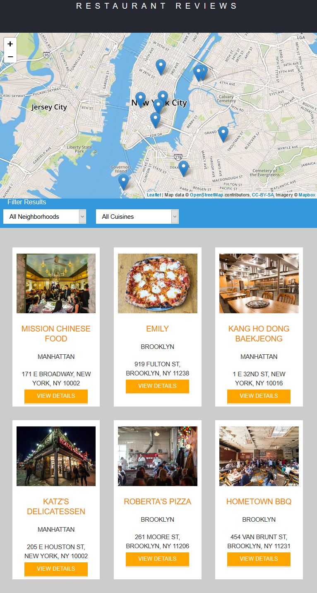

# Restaurant Reviews App
--------

This repo serves as a home for the 'Restaurant Reviews App' project in the Udacity [Frontend Web Development](https://www.udacity.com/course/front-end-web-developer-nanodegree--nd001) Nanodegree. 

This project started as an unresponsive webpage that was gradually converted to a responsive offline application. It uses a database helper (ie. `dbhelper.js` file) to populate data from the `restaurants.json` file. The `main.js` generates the HTML element for the index page, while the `restaurant_info.js` renders the restaurant reviews page. A service worker `sw.js` caches the app data for offline storage allowing users to interact with the app even when offine or with sporatic internet access. 

Resources
--------

:heavy_check_mark: This project uses the following dependencies:

- [ ] Python - read about configuring [Python for your system](https://www.python.org/downloads/)
- [ ] Mapbox [map API](https://www.mapbox.com/mapbox-gl-js/api/)
- [ ] Leaflet.js an open source library for [mobile-friendly maps](https://leafletjs.com/examples/quick-start/)
- [ ] a Service Worker for caching assets for offline use - Read about [service workers](https://developers.google.com/web/fundamentals/primers/service-workers/#what_is_a_service_worker)

Project Setup Instructions
--------

**To setup on a local machine:** :memo: 
1. Fork, clone or download and unzip [this repo](https://github.com/cynsdaemon/restaurant-reviews-app/).
2. In the root of this project's directory launch a local server:
    - Python 2: ```python -m SimpleHTTPServer 8000```
    - Python 3: ```python3 -m http.server 8000```
    - Windows 10 ```py -m http.server 8000```
3. Visit the site in your web browser at http://localhost:8000
4. Change the server port number by updating the `dbhelper.js` file


See [troubleshooting](TROUBLESHOOTING.md) for advice on getting through a few scenarios after setup.

Screenshots of Restaurant Reviews App up and running
--------

### Views of Home page



Miscellaneous
--------

This repository uses the following style guides and repositories:

- Udacity's Project Grading Rubric and [Style Guides](https://github.com/udacity/frontend-nanodegree-styleguide) for the Frontend Nanodegree
- Starter code from Udacity's Mobile Web Specialist project [Restaurant Reviews Stage 1](https://github.com/udacity/mws-restaurant-stage-1)
- MDN Service Worker code snippet [Using Service Workers](https://developer.mozilla.org/en-US/docs/Web/API/Service_Worker_API/Using_Service_Workers)

Reference Links:
- [Debugging Service Workers in Firefox](https://hacks.mozilla.org/2016/03/debugging-service-workers-and-push-with-firefox-devtools/)
- [Managing Service Workers in different browsers](https://www.ghacks.net/2016/03/02/manage-service-workers-in-firefox-and-chrome/)
- [A Brief Guide to Accessibility Tools in Firefox](https://developer.mozilla.org/en-US/docs/Tools/Accessibility_inspector?utm_source=devtools&utm_medium=a11y-panel-toolbar)
- [Aria Roles](https://developer.mozilla.org/en-US/docs/Web/Accessibility/ARIA)
- [Deploying offline- first apps to Github Pages](https://hacks.mozilla.org/2015/11/offline-web-apps-on-github-pages/)

License
--------

For **feedback** feel free to [open an issue on Github](https://github.com/cynsdaemon/restaurant-reviews-app/issues) for this repo. This project is build with love :heart: coffee :coffee: and an awesome playlist :musical_note:. Copyright &copy; 2023-2025 [Cynthia Wright](https://heycynwrites.com).


